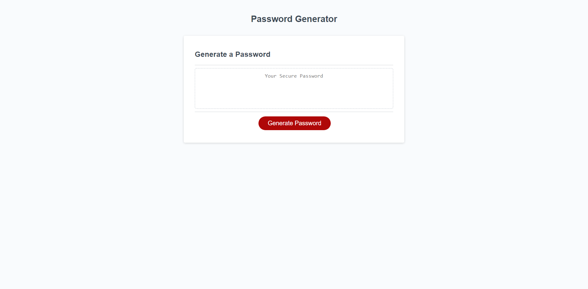

# Password Generator Starter Code
A simple password generator which uses modal windows to solicit the user's parameters for the password, and generates a random password based upon the user selections.

## Description

This application generates a password of a user defined length (between 8-128 characters) and selected character types (uppercase, lowercase, numeric and special). The password is generated via JavaScript code. The script is accessed via html with a button to initiate password generation and prompts and confirms to select password parameters. After selection, the generated password is displayed in the browser window.

### Usage
link do deployed instance of the application:

#### Installation
Upload index.html, script.js, styles.css and to the deployed webserver.

The application shown below was deployed using GitHub Pages. The repository can be replicated by via fork, clone, and redeployment with GitHub Pages.

Link to repository: https://chukwuebukaace.github.io/Password-Generator/
